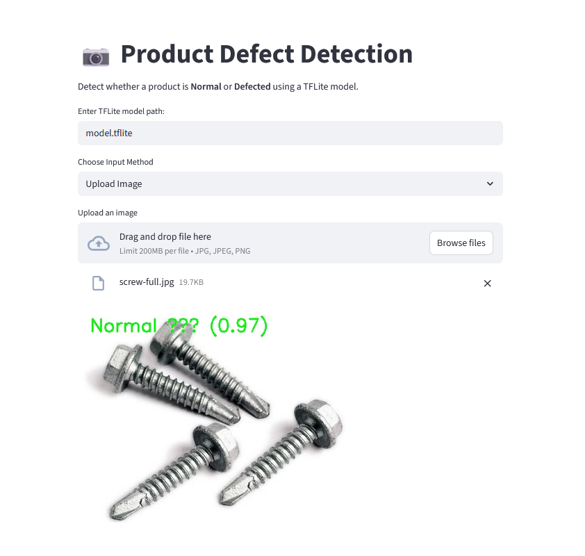
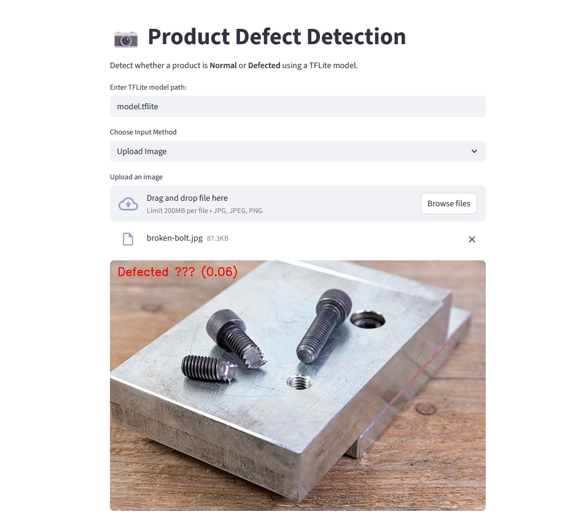

# Defect Detection System

The Defect Detection System is mainly developed for the industries and used to identify if a product or material is defective or not defective.

It is really to use as it is a streamlit app and currently supports 3 different types of input. They are as follows,

- Upload File (manually)
- Using Webcam
- Upload a Video

**Note:** The model file is given in the repo because of the model's size. The model file can be obtained/created by running the defect_detection.ipynb file and an important note is that the app.py file will require the model.tflite file so that the streamlit app can run.

## Installation

Clone the Repository:

```bash
git clone https://github.com/Fay4z/defect-detection-system.git
```

Download the requirements:

```bash
cd defect-detection-system
pip install -r requirements.txt
```

```bash
Open kaggle/google colab and run the defect_detection.ipynb to get model.tflite file
```

Run app.py:

```bash
streamlit run app.py
```

## Outputs



